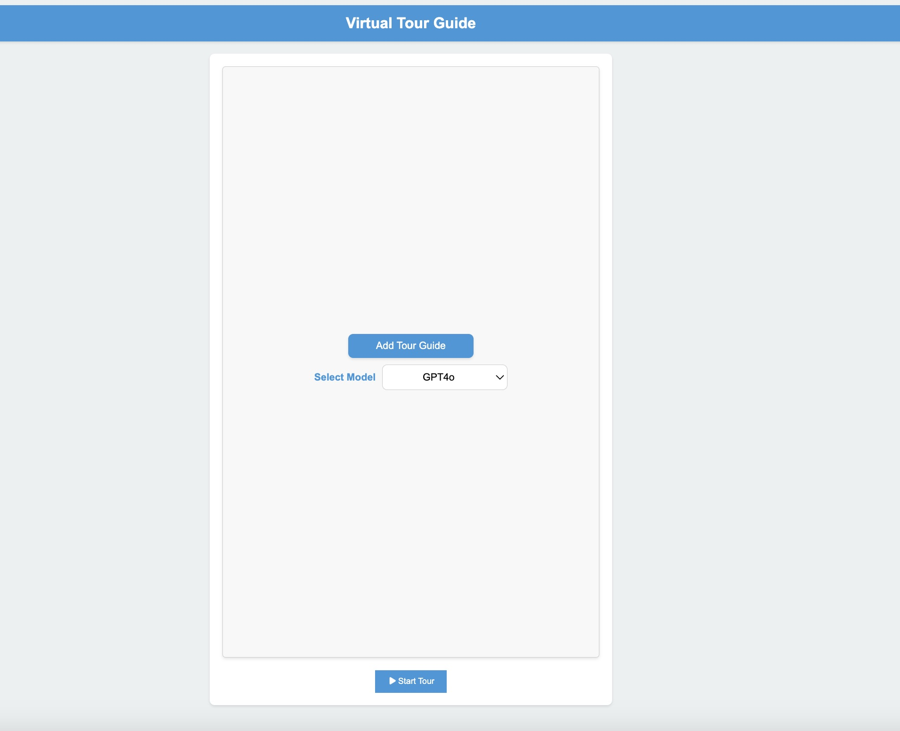
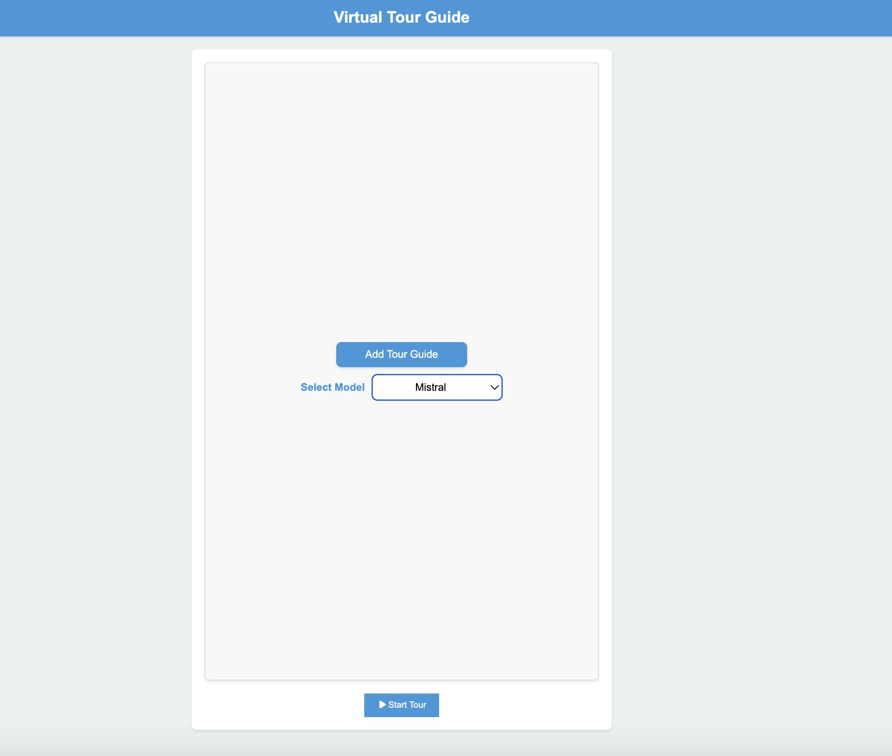
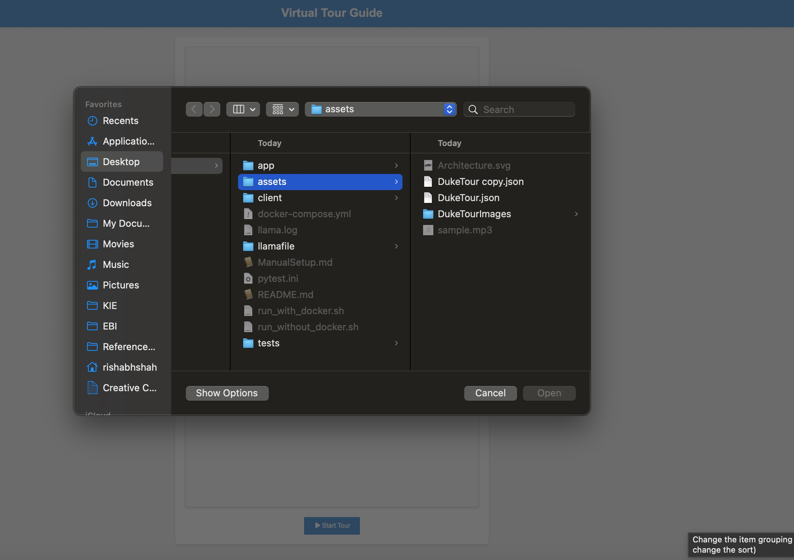
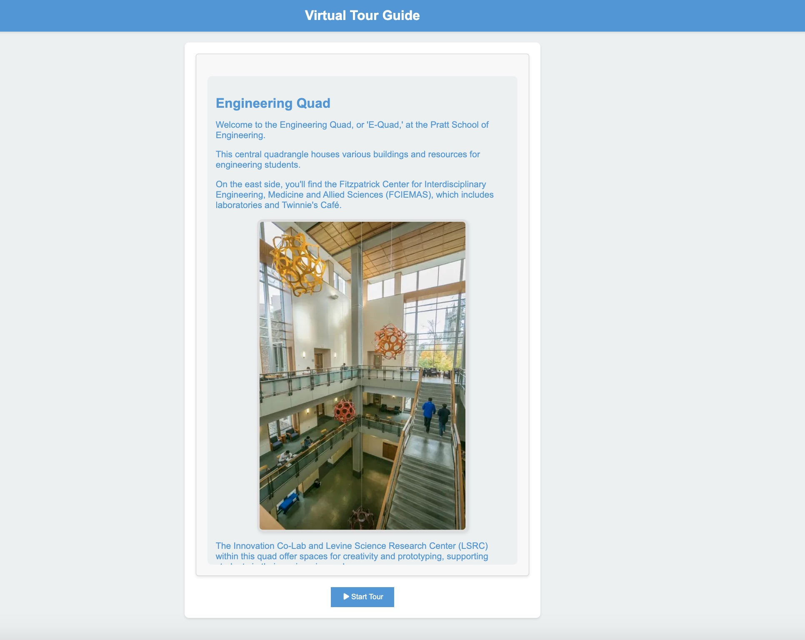
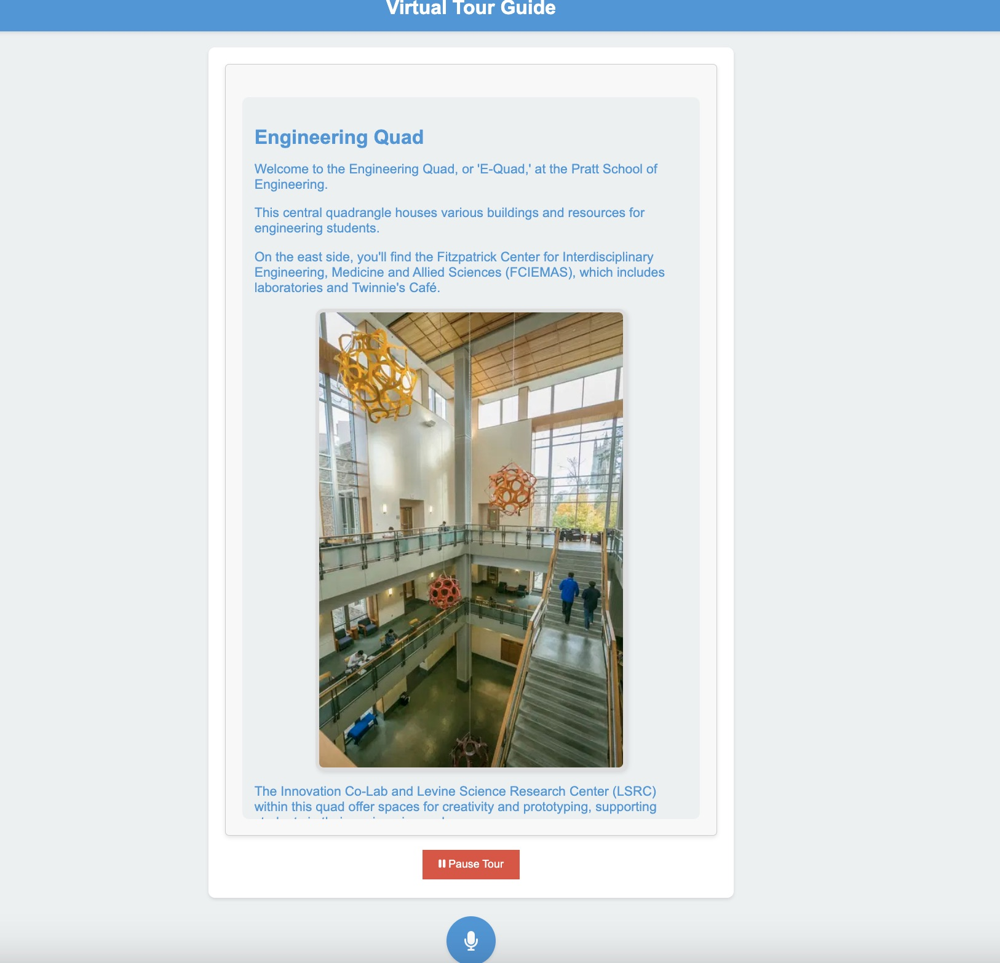
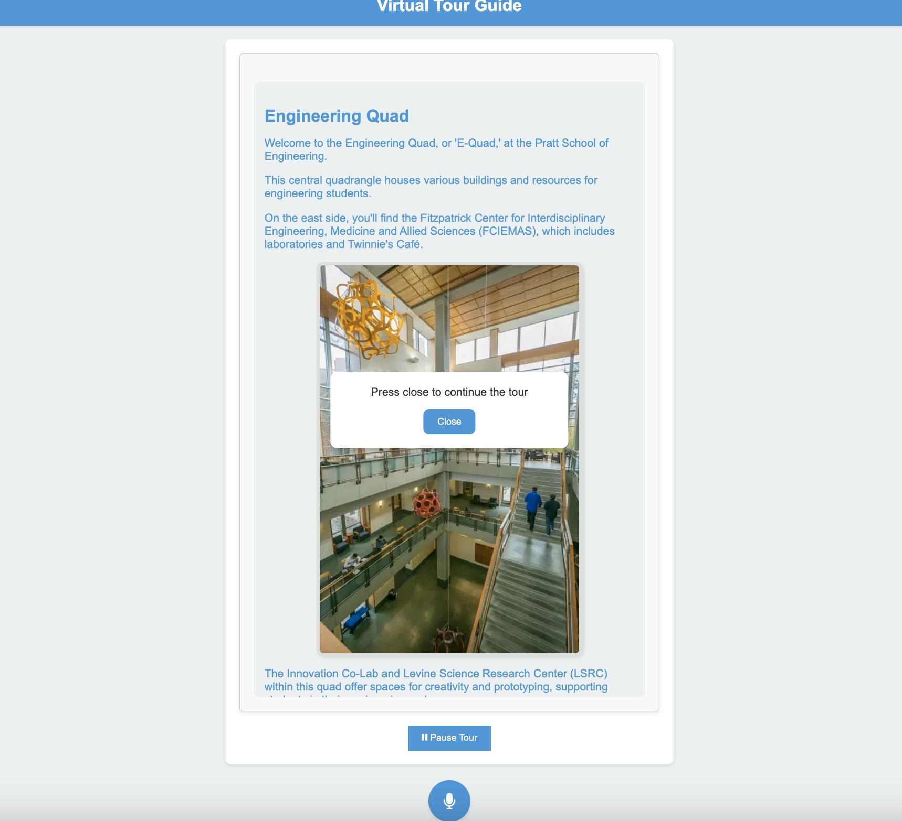

# Virtual Tour Guide

[](https://github.com/rishabhshah13/aitourguide/actions/workflows/ci-cd.yml)

## [Demo Video](https://youtu.be/uwEK3U-4VoY)

## Project Purpose

The AI Tour Guide project is designed to offer an interactive and AI-powered virtual tour guide experience. By integrating advanced text-to-speech (TTS) and speech-to-text (STT) functionalities, the application provides informative and engaging narrations about various locations. It allows users to interact with the guide by asking questions and receiving detailed responses, making their exploration of different places both educational and entertaining.

## Motivation

The motivation behind this project stems from the desire to enhance the experience of exploring new locations through technology. Traditional tour guides and static information can be limiting, and this project aims to leverage AI to create a dynamic and responsive tour guide. By using state-of-the-art natural language processing and speech synthesis technologies, the AI Tour Guide seeks to bridge the gap between digital and physical exploration, providing a richer, more interactive experience for users.

## Features

- **Interactive Tour Guide**: Provides real-time narrations about various locations using text-to-speech capabilities.
- **User Interaction**: Allows users to ask questions about the location and receive relevant answers through speech-to-text and natural language processing.
- **Easy-to-Use Interface**: Features a user-friendly interface for seamless interaction with the AI guide.
- **Continuous Integration and Deployment**: Ensures that updates and improvements are smoothly integrated and deployed, maintaining a high-quality user experience.
- **Backend Integration**: Utilizes a robust backend system to handle user queries and integrate with various TTS and NLP models.
- **Frontend Design**: Implements a clean and intuitive frontend framework to facilitate user interaction and navigation.
- **Deployment and Testing**: Includes a comprehensive deployment setup with CI/CD pipelines and thorough testing to ensure reliability and performance.


## Architecture Diagram

- "Uses" implies a dependency where one component relies on another for its functionality.
- "Communicates with" implies a direct interaction or exchange of information between two components.
  


## Running the Project

1. **Clone the Repository**

   ```bash
   git clone https://github.com/rishabhshah13/aitourguide.git
   cd aitourguide
   ```

Add DeepgramAPI key and OpenAI API key in bash script

2. **Run With Docker**

To set up and run the project with Docker, execute the following script:

```bash
chmod +x run_with_docker.sh
./run_with_docker.sh
```

3. **Run Without Docker**

To set up and run the project without Docker, execute the following script:

```bash
chmod +x run_without_docker.sh
./run_without_docker.sh
```

If you want to setup/run manually refer [this](./ManualSetup.md)


### Testing

1. **Run Frontend Tests**

   ```bash
   cd client
   npm test
   ```

2. **Run Backend Tests**

   ```bash
   cd ../app
   pytest
   ```

### Examples and Screenshots

**Welcome Screen:**


**Model selection using the dropdown:**


**Selecting Tour:**


**Tour Loaded Screen**


**In-Tour Screen with option to Pause**

When you press the question button, hold on until the AI completes its current section. Once it's finished, the button will turn red, signaling that it's your turn to ask a question.

**After Question Popup**


## Performance/Evaluation Results

The application demonstrates efficient performance, with response times around 606.01 ms for text-to-speech requests and 222.76 ms for speech-to-text conversions. For a comprehensive breakdown of performance metrics, please consult the performance reports provided [here](./tests/assets/).

While running the containers, run the following commands

 ```bash
  python tests/evaluation.py 
  ```

 ```bash
  cd client
  npm run evaluate 
  ```


## Unit Tests

Unit tests for core functionalities are located in the `/tests` folder. To run the tests, use the following commands:

- **Frontend Tests**

  ```bash
  cd client
  npm test
  ```

- **Backend Tests**

  ```bash
  pytest
  ```
## Acknowledgments

Special thanks to the following resources for inspiring the development of this application:

- [YouVisit Duke Tour](https://www.youvisit.com/tour/duke)
- [Duke Tour App](https://duke.stqry.app/)

These applications provided the idea and motivation for creating this virtual tour guide application.

