# Virtual Tour Guide

[](https://github.com/rishabhshah13/aitourguide/actions/workflows/ci-cd.yml)

## [Demo Video](https://your-demo-video-link.com)

## Project Purpose

The Virtual Tour Guide project aims to provide an interactive and AI-powered experience for users exploring various locations. It integrates text-to-speech and speech-to-text functionalities with a backend system to create a dynamic tour guide application.

## Architecture Diagram

- "Uses" implies a dependency where one component relies on another for its functionality.
- "Communicates with" implies a direct interaction or exchange of information between two components.
  



## Running the Project

1. **Clone the Repository**

   ```bash
   git clone https://github.com/rishabhshah13/aitourguide.git
   cd aitourguide
   ```

Add DeepgramAPI key and OpenAI API key in bash script

2. **Run With Docker**

To set up and run the project with Docker, execute the following script:

```bash
./run_with_docker.sh
```

3. **Run Without Docker**

To set up and run the project without Docker, execute the following script:

```bash
./run_without_docker.sh
```

If you want to setup/run manually refer [this](./ManualSetup.md)


### Testing

1. **Run Frontend Tests**

   ```bash
   cd client
   npm test
   ```

2. **Run Backend Tests**

   ```bash
   cd ../app
   pytest
   ```

### Examples and Screenshots

**Frontend Example:**


**Backend Example:**


## Performance/Evaluation Results

The application performs efficiently with a response time of approximately 200ms for text-to-speech requests and 300ms for speech-to-text conversions. For detailed performance metrics, refer to the performance reports available [here](./performance_reports).

## Unit Tests

Unit tests for core functionalities are located in the `/tests` folder. To run the tests, use the following commands:

- **Frontend Tests**

  ```bash
  cd client
  npm test
  ```

- **Backend Tests**

  ```bash
  cd ../app
  pytest
  ```
